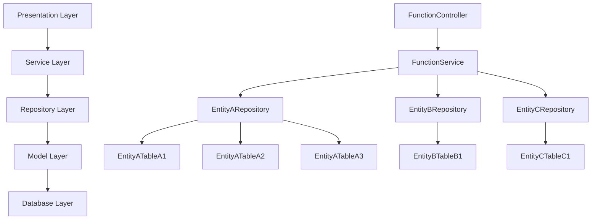

# OpenSpec Instructions

Instructions for AI coding assistants using OpenSpec for spec-driven development.

## TL;DR Quick Checklist

- Search existing work: `openspec spec list --long`, `openspec list` (use `rg` only for full-text search)
- Decide scope: new capability vs modify existing capability
- Pick a unique `change-id`: kebab-case, verb-led (`add-`, `update-`, `remove-`, `refactor-`)
- Scaffold: `proposal.md`, `tasks.md`, `design.md`, and delta specs per affected capability
- Write deltas: use `## ADDED|MODIFIED|REMOVED|RENAMED Requirements`; include at least one `#### Scenario:` per requirement
- Validate: `openspec validate [change-id] --strict` and fix issues
- Request approval: Do not start implementation until proposal is approved

## Three-Stage Workflow

### Stage 1: Creating Changes
Create proposal when you need to:
- Add features or functionality
- Make breaking changes (API, schema)
- Change architecture or patterns  
- Optimize performance (changes behavior)
- Update security patterns

Triggers (examples):
- "Help me create a change proposal"
- "Help me plan a change"
- "Help me create a proposal"
- "I want to create a spec proposal"
- "I want to create a spec"

Loose matching guidance:
- Contains one of: `proposal`, `change`, `spec`
- With one of: `create`, `plan`, `make`, `start`, `help`

Skip proposal for:
- Bug fixes (restore intended behavior)
- Typos, formatting, comments
- Dependency updates (non-breaking)
- Configuration changes
- Tests for existing behavior

**Workflow**
1. Review `openspec/project.md`, `openspec list`, and `openspec list --specs` to understand current context.
2. Choose a unique verb-led `change-id` and scaffold `proposal.md`, `tasks.md`, `design.md`, and spec deltas under `openspec/changes/<id>/`.
3. Draft spec deltas using `## ADDED|MODIFIED|REMOVED Requirements` with at least one `#### Scenario:` per requirement.
4. Run `openspec validate <id> --strict` and resolve any issues before sharing the proposal.

### Stage 2: Implementing Changes
Track these steps as TODOs and complete them one by one.
1. **Read proposal.md** - Understand what's being built
2. **Read design.md** - Review technical decisions
3. **Read tasks.md** - Get implementation checklist
4. **Implement tasks sequentially** - Complete in order
5. **Confirm completion** - Ensure every item in `tasks.md` is finished before updating statuses
6. **Update checklist** - After all work is done, set every task to `- [x]` so the list reflects reality
7. **Approval gate** - Do not start implementation until the proposal is reviewed and approved

### Stage 3: Archiving Changes
After deployment, create separate PR to:
- Move `changes/[name]/` → `changes/archive/YYYY-MM-DD-[name]/`
- Update `specs/` if capabilities changed
- Use `openspec archive <change-id> --skip-specs --yes` for tooling-only changes (always pass the change ID explicitly)
- Run `openspec validate --strict` to confirm the archived change passes checks

## Before Any Task

**Context Checklist:**
- [ ] Read relevant specs in `specs/[capability]/spec.md`
- [ ] Check pending changes in `changes/` for conflicts
- [ ] Read `openspec/project.md` for conventions
- [ ] Run `openspec list` to see active changes
- [ ] Run `openspec list --specs` to see existing capabilities

**Before Creating Specs:**
- Always check if capability already exists
- Prefer modifying existing specs over creating duplicates
- Use `openspec show [spec]` to review current state
- If request is ambiguous, ask 1–2 clarifying questions before scaffolding

### Search Guidance
- Enumerate specs: `openspec spec list --long` (or `--json` for scripts)
- Enumerate changes: `openspec list` (or `openspec change list --json` - deprecated but available)
- Show details:
  - Spec: `openspec show <spec-id> --type spec` (use `--json` for filters)
  - Change: `openspec show <change-id> --json --deltas-only`
- Full-text search (use ripgrep): `rg -n "Requirement:|Scenario:" openspec/specs`

## Quick Start

### CLI Commands

```bash
# Essential commands
openspec list                  # List active changes
openspec list --specs          # List specifications
openspec show [item]           # Display change or spec
openspec validate [item]       # Validate changes or specs
openspec archive <change-id> [--yes|-y]   # Archive after deployment (add --yes for non-interactive runs)

# Project management
openspec init [path]           # Initialize OpenSpec
openspec update [path]         # Update instruction files

# Interactive mode
openspec show                  # Prompts for selection
openspec validate              # Bulk validation mode

# Debugging
openspec show [change] --json --deltas-only
openspec validate [change] --strict
```

### Command Flags

- `--json` - Machine-readable output
- `--type change|spec` - Disambiguate items
- `--strict` - Comprehensive validation
- `--no-interactive` - Disable prompts
- `--skip-specs` - Archive without spec updates
- `--yes`/`-y` - Skip confirmation prompts (non-interactive archive)

## Directory Structure

```
openspec/
├── project.md              # Project conventions
├── specs/                  # Current truth - what IS built
│   └── [capability]/       # Single focused capability
│       ├── spec.md         # Requirements and scenarios
│       └── design.md       # Technical patterns
├── changes/                # Proposals - what SHOULD change
│   ├── [change-name]/
│   │   ├── proposal.md     # Why, what, impact
│   │   ├── tasks.md        # Implementation checklist
│   │   ├── design.md       # Technical decisions
│   │   └── specs/          # Delta changes
│   │       └── [capability]/
│   │           └── spec.md # ADDED/MODIFIED/REMOVED
│   └── archive/            # Completed changes
```

## Creating Change Proposals

### Decision Tree

```
New request?
├─ Bug fix restoring spec behavior? → Fix directly
├─ Typo/format/comment? → Fix directly  
├─ New feature/capability? → Create proposal
├─ Breaking change? → Create proposal
├─ Architecture change? → Create proposal
└─ Unclear? → Create proposal (safer)
```

### Proposal Structure

1. **Create directory:** `changes/[change-id]/` (kebab-case, verb-led, unique)

2. **Write proposal.md:**
```markdown
# Change: [Brief description of change]

## Why
[1-2 sentences on problem/opportunity]

## What Changes
- [Bullet list of changes]
- [Mark breaking changes with **BREAKING**]

## Impact
- Affected specs: [list capabilities]
- Affected code: [key files/systems]

## Business Context
### Business Background
[Describe the business purpose and current user scenario]

### Goals and Objectives
[List goals, objectives, and constraints]

## Scope and Requirements
### Included Content
- [List specific features, functionalities, or requirements that are included in the scope]

### Excluded Content
- [List features, functionalities, or requirements that are explicitly excluded from the scope]

## System Design Considerations
### System Boundaries and Interfaces
[Define system boundaries, interfaces, and dependencies]

### User Roles and Permissions
[Describe user roles, permissions, and access control policies]

### Performance and Scalability
[Include performance metrics and scalability requirements]

### Error Handling and Recovery
[Define error codes, exception handling, and recovery procedures]

### Security and Compliance
[Document compliance and security requirements (e.g., GDPR)]

### UI Elements and User Experience
[Provide UI element descriptions or links to wireframes/mockups]
```

3. **Create spec deltas:** `specs/[capability]/spec.md`
```markdown
## ADDED Requirements
### Requirement: New Feature
The system SHALL provide...

#### Scenario: Success case
- **WHEN** user performs action
- **THEN** expected result

## MODIFIED Requirements
### Requirement: Existing Feature
[Complete modified requirement]

## REMOVED Requirements
### Requirement: Old Feature
**Reason**: [Why removing]
**Migration**: [How to handle]
```
If multiple capabilities are affected, create multiple delta files under `changes/[change-id]/specs/<capability>/spec.md`—one per capability.

4. **Create tasks.md:**
```markdown
## 1. Implementation
- [ ] 1.1 Create database schema
- [ ] 1.2 Implement API endpoint
- [ ] 1.3 Add frontend component
- [ ] 1.4 Write tests
```

5. **Create design.md:**
```markdown
## Context
[Background, constraints, stakeholders]

## Goals / Non-Goals
- Goals: [...]
- Non-Goals: [...]

## Decisions
- Decision: [What and why]
- Alternatives considered: [Options + rationale]

## Risks / Trade-offs
- [Risk] → Mitigation

## Migration Plan
[Steps, rollback]

## Open Questions
- [...]

## Technical Design Elements

### System Architecture

#### Code Layers Overview



Layer Responsibilities:
- **Presentation Layer**: Handles HTTP requests/responses and view rendering
- **Service Layer**: Implements business logic and orchestrates operations
- **Repository Layer**: Provides data access abstraction
- **Model Layer**: Defines data structures and relationships
- **Database Layer**: Manages physical data storage

### Module Design and Implementation

#### [Module/Library Name]

##### [Class/Component Name]

- **Purpose**: [Describe the functionality and purpose of the class]
- **Location**: [Code path of the class or import method]
- **Status**: [Existing/New/Modified/Deleted]

**Interface Details:**
- **Existing Method**
  - **Name**: [Method name]
  - **Description**: [What the method does]
  - **Parameters**:
  
    | Name | Type | Required | Description |
    |------|------|----------|-------------|
    | param1 | String | Yes | Description |
    
  - **Returns**:
  
    | Name | Type | Description |
    |------|------|-------------|
    | result | Boolean | Operation success |

- **Modified Method**
  - **Name**: [Method name]
  - **Description**: [What the method does]
  - **Changes**: [What was modified and why]
  - **Parameters**:
  
    | Name | Type | Required | Description |
    |------|------|----------|-------------|
    | param1 | String | Yes | Description |
    
  - **Returns**:
  
    | Name | Type | Description |
    |------|------|-------------|
    | result | Boolean | Operation success |

- **New Method**
  - **Name**: [Method name]
  - **Description**: [What the method does]
  - **Parameters**:
  
    | Name | Type | Required | Description |
    |------|------|----------|-------------|
    | param1 | String | Yes | Description |
    
  - **Returns**:
  
    | Name | Type | Description |
    |------|------|-------------|
    | data | Object | Returned data |

- **Deleted Method**
  - **Name**: [Method name]
  - **Reason**: [Why it was removed]
  - **Impact**: [Locations where calls need removal]

### Function Module Design and Implementation

#### Business Process

- **Background**: [Functional module background]
- **Main Steps**:
  - [Step 1 description]
  - [Step 2 description]
- **Exceptions**:
  - [Exception handling details]

#### Data Table Design

##### Existing Tables

- **Main Table 1**:
  - **Purpose**: [Table purpose]

| Field | Type | Constraint | Description |
|-------|------|------------|-------------|
| field1 | VARCHAR | PRIMARY KEY | Description |

##### New Tables

- **New Table 1**:
  - **Purpose**: [Table purpose]

| Field | Type | Constraint | Description |
|-------|------|------------|-------------|
| field1 | VARCHAR | PRIMARY KEY | Description |

##### Database ER Diagram
[Add an ER diagram with Mermaid or PlantUML]

#### Function Development and Implementation

##### Code Implementation Details

- **File 1**
  - **Path**: [Code path]
  - **Status**: [Existing/New/Modified/Deleted]
  - **Methods**
    - **Existing Method**
      - **Name**: [Method name]
      - **Description**: [What the method does]
      - **Parameters**:
      
        | Name | Type | Required | Description |
        |------|------|----------|-------------|
        | param1 | String | Yes | Description |
        
      - **Returns**:
      
        | Name | Type | Description |
        |------|------|-------------|
        | result | Boolean | Operation success |

    - **Modified Method**
      - **Name**: [Method name]
      - **Description**: [What the method does]
      - **Changes**: [What was modified and why]
      - **Parameters**:
      
        | Name | Type | Required | Description |
        |------|------|----------|-------------|
        | param1 | String | Yes | Description |
        
      - **Returns**:
      
        | Name | Type | Description |
        |------|------|-------------|
        | data | Object | Returned data |

    - **New Method**
      - **Name**: [Method name]
      - **Description**: [What the method does]
      - **Parameters**:
      
        | Name | Type | Required | Description |
        |------|------|----------|-------------|
        | param1 | String | Yes | Description |
        
      - **Returns**:
      
        | Name | Type | Description |
        |------|------|-------------|
        | data | Object | Returned data |

    - **Deleted Method**
      - **Name**: [Method name]
      - **Reason**: [Why it was removed]
      - **Impact**: [Locations where calls need removal]

#### Frontend Implementation

##### View Directory Structure
```plaintext
/resources/views/sample-module/sample-feature/sample-component/
  main-page.blade.php        - Main page
  _form-partial.blade.php    - Form partial
  _table-partial.blade.php   - Table partial
  _alerts-partial.blade.php  - Alert messages partial

/public/js/sample-module/sample-feature/sample-component/
  main-functionality.js      - Main functionality
  validation.js              - Client-side validation
  file-handler.js            - File handling utilities
  table-functionality.js     - Table functionality
```

##### API Design & Integration
- **Endpoints**:
| Method | Endpoint | Description |
|--------|----------|-------------|
| GET | /api/sample | Get data |
| POST | /api/sample | Create new |

- **Data Model**:
```json
{
  "id": "integer",
  "name": "string",
  "description": "string",
  "created_at": "datetime",
  "updated_at": "datetime"
}
```
```

## Spec File Format

### Critical: Scenario Formatting

**CORRECT** (use #### headers):
```markdown
#### Scenario: User login success
- **WHEN** valid credentials provided
- **THEN** return JWT token
```

**WRONG** (don't use bullets or bold):
```markdown
- **Scenario: User login**  ❌
**Scenario**: User login     ❌
### Scenario: User login      ❌
```

Every requirement MUST have at least one scenario.

### Requirement Wording
- Use SHALL/MUST for normative requirements (avoid should/may unless intentionally non-normative)

### Delta Operations

- `## ADDED Requirements` - New capabilities
- `## MODIFIED Requirements` - Changed behavior
- `## REMOVED Requirements` - Deprecated features
- `## RENAMED Requirements` - Name changes

Headers matched with `trim(header)` - whitespace ignored.

#### When to use ADDED vs MODIFIED
- ADDED: Introduces a new capability or sub-capability that can stand alone as a requirement. Prefer ADDED when the change is orthogonal (e.g., adding "Slash Command Configuration") rather than altering the semantics of an existing requirement.
- MODIFIED: Changes the behavior, scope, or acceptance criteria of an existing requirement. Always paste the full, updated requirement content (header + all scenarios). The archiver will replace the entire requirement with what you provide here; partial deltas will drop previous details.
- RENAMED: Use when only the name changes. If you also change behavior, use RENAMED (name) plus MODIFIED (content) referencing the new name.

Common pitfall: Using MODIFIED to add a new concern without including the previous text. This causes loss of detail at archive time. If you aren’t explicitly changing the existing requirement, add a new requirement under ADDED instead.

Authoring a MODIFIED requirement correctly:
1) Locate the existing requirement in `openspec/specs/<capability>/spec.md`.
2) Copy the entire requirement block (from `### Requirement: ...` through its scenarios).
3) Paste it under `## MODIFIED Requirements` and edit to reflect the new behavior.
4) Ensure the header text matches exactly (whitespace-insensitive) and keep at least one `#### Scenario:`.

Example for RENAMED:
```markdown
## RENAMED Requirements
- FROM: `### Requirement: Login`
- TO: `### Requirement: User Authentication`
```

## Troubleshooting

### Common Errors

**"Change must have at least one delta"**
- Check `changes/[name]/specs/` exists with .md files
- Verify files have operation prefixes (## ADDED Requirements)

**"Requirement must have at least one scenario"**
- Check scenarios use `#### Scenario:` format (4 hashtags)
- Don't use bullet points or bold for scenario headers

**Silent scenario parsing failures**
- Exact format required: `#### Scenario: Name`
- Debug with: `openspec show [change] --json --deltas-only`

### Validation Tips

```bash
# Always use strict mode for comprehensive checks
openspec validate [change] --strict

# Debug delta parsing
openspec show [change] --json | jq '.deltas'

# Check specific requirement
openspec show [spec] --json -r 1
```

## Happy Path Script

```bash
# 1) Explore current state
openspec spec list --long
openspec list
# Optional full-text search:
# rg -n "Requirement:|Scenario:" openspec/specs
# rg -n "^#|Requirement:" openspec/changes

# 2) Choose change id and scaffold
CHANGE=add-two-factor-auth
mkdir -p openspec/changes/$CHANGE/{specs/auth}
printf "## Why\n...\n\n## What Changes\n- ...\n\n## Impact\n- ...\n" > openspec/changes/$CHANGE/proposal.md
printf "## 1. Implementation\n- [ ] 1.1 ...\n" > openspec/changes/$CHANGE/tasks.md

# 3) Add deltas (example)
cat > openspec/changes/$CHANGE/specs/auth/spec.md << 'EOF'
## ADDED Requirements
### Requirement: Two-Factor Authentication
Users MUST provide a second factor during login.

#### Scenario: OTP required
- **WHEN** valid credentials are provided
- **THEN** an OTP challenge is required
EOF

# 4) Validate
openspec validate $CHANGE --strict
```

## Multi-Capability Example

```
openspec/changes/add-2fa-notify/
├── proposal.md
├── tasks.md
└── specs/
    ├── auth/
    │   └── spec.md   # ADDED: Two-Factor Authentication
    └── notifications/
        └── spec.md   # ADDED: OTP email notification
```

auth/spec.md
```markdown
## ADDED Requirements
### Requirement: Two-Factor Authentication
...
```

notifications/spec.md
```markdown
## ADDED Requirements
### Requirement: OTP Email Notification
...
```

## Best Practices

### Simplicity First
- Default to <100 lines of new code
- Single-file implementations until proven insufficient
- Avoid frameworks without clear justification
- Choose boring, proven patterns

### Complexity Triggers
Only add complexity with:
- Performance data showing current solution too slow
- Concrete scale requirements (>1000 users, >100MB data)
- Multiple proven use cases requiring abstraction

### Clear References
- Use `file.ts:42` format for code locations
- Reference specs as `specs/auth/spec.md`
- Link related changes and PRs

### Capability Naming
- Use verb-noun: `user-auth`, `payment-capture`
- Single purpose per capability
- 10-minute understandability rule
- Split if description needs "AND"

### Change ID Naming
- Use kebab-case, short and descriptive: `add-two-factor-auth`
- Prefer verb-led prefixes: `add-`, `update-`, `remove-`, `refactor-`
- Ensure uniqueness; if taken, append `-2`, `-3`, etc.

## Tool Selection Guide

| Task | Tool | Why |
|------|------|-----|
| Find files by pattern | Glob | Fast pattern matching |
| Search code content | Grep | Optimized regex search |
| Read specific files | Read | Direct file access |
| Explore unknown scope | Task | Multi-step investigation |

## Error Recovery

### Change Conflicts
1. Run `openspec list` to see active changes
2. Check for overlapping specs
3. Coordinate with change owners
4. Consider combining proposals

### Validation Failures
1. Run with `--strict` flag
2. Check JSON output for details
3. Verify spec file format
4. Ensure scenarios properly formatted

### Missing Context
1. Read project.md first
2. Check related specs
3. Review recent archives
4. Ask for clarification

## Quick Reference

### Stage Indicators
- `changes/` - Proposed, not yet built
- `specs/` - Built and deployed
- `archive/` - Completed changes

### File Purposes
- `proposal.md` - Why and what
- `tasks.md` - Implementation steps
- `design.md` - Technical decisions
- `spec.md` - Requirements and behavior

### CLI Essentials
```bash
openspec list              # What's in progress?
openspec show [item]       # View details
openspec validate --strict # Is it correct?
openspec archive <change-id> [--yes|-y]  # Mark complete (add --yes for automation)
```

Remember: Specs are truth. Changes are proposals. Keep them in sync.

## Keyword-Triggered Skills

When user input matches any trigger pattern below, **MUST** read the corresponding skills file and follow the complete workflow defined therein.

### Review Flows

| Trigger Pattern | Skills File |
|-----------------|-------------|
| `proposal self review [change-id]` (case-insensitive) | `@/openspec/skills/proposal-self-review.md` |
| `design self review [change-id]` (case-insensitive) | `@/openspec/skills/design-self-review.md` |
| `tasks self review [change-id]` (case-insensitive) | `@/openspec/skills/tasks-self-review.md` |

### Document Generation Flows

| Trigger Pattern | Skills File |
|----------------|-------------|
| `Generate FS [change-id]` (case-insensitive) | `@/openspec/skills/generate-FS-document.md` |
| `Generate TS [change-id]` (case-insensitive) | `@/openspec/skills/generate-TS-document.md` |
| `Generate TS FB [change-id]` (case-insensitive) | `@/openspec/skills/generate-TS-document.md` |
| `Generate Test Case [change-id]` or `GenerateTestCase [change-id]` (case-insensitive) | `@/openspec/skills/generate-testcase-document.md` |
| `update TS autotest [change-id]` (case-insensitive) | `@/openspec/skills/update-TS-autotesting.md` |

**Change-id handling (review & generation):**
- If user input omits `[change-id]`, auto-select the first entry under `openspec/changes/` (sorted by directory listing); if none exist, ask the user to provide a kebab-case change-id.
- If `[change-id]` is provided, validate it exists under `openspec/changes/`; if not, ask the user to confirm or provide a valid one.


## AI 数字溯源协议 (Digital Provenance)

为了确保项目的透明度与 AIBOM (AI Bill of Materials) 的准确性，AI 在实现代码时必须主动添加溯源标记。

### A. 标注原则与范围限制 (重要)
- **仅限业务代码**：标记仅允许出现在 `src/` 目录下的业务源码中。
- **严禁修改插件/库**：**绝对禁止**在 `node_modules`、外部 Plugins、`package.json` 或环境配置文件（如 `angular.json`, `tsconfig.json`）中添加任何溯源标记。
- **免标路径**：位于 `src/app/pages/ai-gen/` 目录下的文件会被系统自动识别，无需手动添加注释。

### B. 标注语法执行
请根据代码改动的规模选择合适的标记方式：

| 场景 | 标记语法 | 放置位置 |
| :--- | :--- | :--- |
| **全文件 AI 生成** | `// @ai-generated` | 文件最顶部（前 5 行内） |
| **局部代码块修改** | `// @ai-start` <br> `[AI 实现的代码]` <br> `// @ai-end` | 包裹新增或修改的功能逻辑 |

### C. 示例参考
**局部逻辑修改示例：**
```typescript
async processData() {
  const data = await this.getData();
  // @ai-start
  // AI 根据 OpenSpec 提案实现的过滤逻辑
  const result = data.filter(item => item.active && item.score > 80);
  // @ai-end
  return result;
}