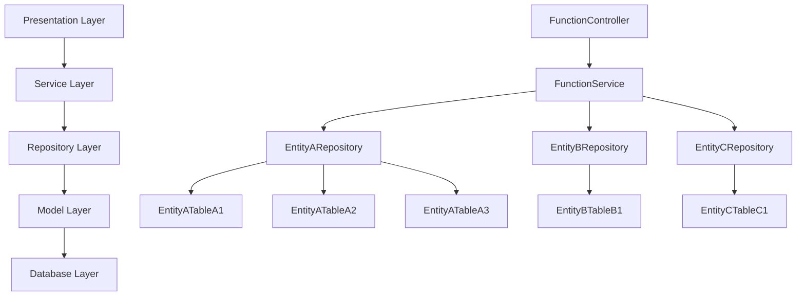

# Technical Design Document - [Function Name]

## Document Information

### Document Revision History

| Version | Date | Author | Description |
|---------|------|---------|------------|
| 1.0 | 2025-06-04 | DHC.XXX | Initial creation of technical design document based on FS |

### Document Review History
| Version | Date | Reviewer | Comments |
|---------|------|---------|----------|
| 1.0 | 2025-07-28 | XXXX |  |


## 1. Project Background and Overview

### 1.1 Project Requirements Background

[Describe the project background information here, for example: This project aims to develop a [system name], used for [system purpose]. It mainly includes [specific features], etc.]

### 1.2 Terms and Definitions (Optional, special definitions that need to be explained in advance, or abbreviations of certain content, please place in this section.)

| Term/Abbreviation | Full Name/Explanation |
|--------|---------|
| PM | Project Manager |
| IA | Installation Assistant |

### 1.3 Constraints (Optional, use specific technologies/approaches to limit AI development direction, only for this development; if public or reusable, place in the rule)

- [Restrict the scope of the current requirements generation]  
- [Technologies, frameworks, tools, or platforms that must or must not be used]
- [Mandatory requirements for performance, security, compatibility, etc.]
- [Integration limitations with external systems or interfaces]
- [Constraints related to project timeline, resources, or budget]
- [Special agreements or exclusive conditions specific to this project]

## 1.4 System Architecture

### 1.4.1 Code Layers Overview (Optional,Better to show mermaid diagram of code architecture of your functions module)



Each layer has specific responsibilities:
- **Presentation Layer**: Handles HTTP requests/responses and view rendering
- **Service Layer**: Implements business logic and orchestrates operations
- **Repository Layer**: Provides data access abstraction
- **Model Layer**: Defines data structures and relationships
- **Database Layer**: Manages physical data storage


## 2. Common Module/Library Design and Function Extension/Optimization (Current requirements involve common module or library description and additions/modifications)

- [This section describes the modifications and new designs of common modules involved in the current requirements, including the module's functionality, interface definition, and status.]

### 2.1 [Module/Library Name, such as "User Authentication Service"/or directly call it New/Existing Module]

- **Key Point**: [If there are globally common components that serve all modules and do not require modification, consider placing them in the project rule file.]

#### 2.1.1 [Class/Component Name]

- **Overview**: [Describe the functionality and purpose of the existing class]
- **Code Path**: [Code path of the class or import method]
- **File Status**: [Existing]
- **Interface Definition**:
  - **Existing Method**
    - **Interface Name**: [Name of the method]
    - **Function Description**: [Description of the method's functionality]
    - **Method Status**: [Existing]
    - **Request Parameters**:

      | Parameter Name | Data Type | Required | Description |
      |--------|----------|----------|------|
      | Parameter1 | String   | Yes       | Description of parameter1 |
      | Parameter2 | String   | Yes       | Description of parameter2 |
      | Parameter3 | String   | Yes       | Description of parameter3 |

    - **Response Data**:

      | Parameter Name | Data Type | Description |
      |--------|----------|------|
      | Result   | Boolean  | Whether the operation is successful |

  - **Modified Method**
    - **Interface Name**: [Name of the method]
    - **Function Description**: [Description of the method's functionality]
    - **Method Status**: [Modified]
    - **Modification Content**: [Describe the content and reason for modification]
    - **Request Parameters**:

      | Parameter Name | Data Type | Required | Description |
      |--------|----------|----------|------|
      | Parameter1 | String   | Yes       | Description of parameter1 |
      | Parameter2 | String   | Yes       | Description of parameter2 |
      | Parameter3 | String   | Yes       | Description of parameter3 |

    - **Response Data**:

      | Parameter Name | Data Type | Description |
      |--------|----------|------|
      | Result   | Boolean  | Whether the operation is successful |

    - **Sample Code(Nice to have)**: [Code example, could paste the existing code already used in the project or code guide for reference]

  - **New Method**
    - **Interface Name**: [Name of the method]
    - **Function Description**: [Description of the method's functionality]
    - **Method Status**: [New]
    - **Code Example**: [Add code example]
    - **Call Sequence**: [Add call sequence]
    - **Request Parameters**:

      | Parameter Name | Data Type | Required | Description |
      |--------|----------|----------|------|
      | Parameter1 | String   | Yes       | Description of parameter1 |

    - **Response Data**:

      | Parameter Name | Data Type | Description |
      |--------|----------|------|
      | Data   | Object   | Returned data object |

    - **Sample Code(Nice to have)**: [Code example, could paste the existing code already used in the project or code guide for reference]

  - **Deleted Method**
    - **Interface Name**: [Name of the method]
    - **Method Status**: [Deleted]
    - **Deletion Reason**: [Describe the content and reason for deletion]
    - **Associated Call Deletion**: [Mark all locations that call this method for deletion]

## 3. Function Module Design and Implementation

This section describes the design and implementation of your functional modules, including business processes, data table design, and code implementation details.

### 3.1 Business Module

#### 3.1.1 Business Process

- **Design/Page 1**:  
  
  - [Better to attach images before and after the design]

- **Background**: [Describe the background of the functional module]
- **UI/UX Design(Nice to Have)**: 
[Attach your UI/UX design links of html files.]
- **Main Process**:
  - [Describe the steps of the main process]
  - [Step 1 description]
  - [Step 2 description]
- **Exception Process**:
  - [Describe the steps of the exception process]
  - [Exception scenario 1 description]
- **Flow Chart**:
[Add a flow chart to help AI better understand the process and reduce description]

#### 3.1.2 Data Table Design

##### 3.1.2.1 Existing Tables

- **Main Table 1**:
  - **Table Description**: [Mark out if any columns are new added or modified in the existing table, and describe the purpose of the table, such as storing user information, product details, etc.]

| Field Name | Data Type | Constraint | Description |
|--------|----------|------|------|
| Field1  | VARCHAR  | PRIMARY KEY | Description of field1 |
| Field2  | VARCHAR  | NOT NULL    | Description of field2 |
| Field3  | VARCHAR  | UNIQUE      | Description of field3 |


- **Main Table 2**:
    **Table Description**: [Mark out if any columns are new added or modified in the existing table, and describe the purpose of the table, such as storing user information, product details, etc.]

| Field Name | Data Type | Constraint | Description |
|--------|----------|------|------|
| Field1  | VARCHAR  | PRIMARY KEY | Description of field1 |
| Field2  | VARCHAR  | NOT NULL    | Description of field2 |
| Field3  | VARCHAR  | UNIQUE      | Description of field3 |


- **Association Table 1**:
  - **Table Description**: [Strongly to fill in the association table description and note down the association table.fields in column description, such as storing the relationship between users and roles, products and categories, etc.]

| Field Name | Data Type | Constraint | Description |
|--------|----------|------|------|
| Field1  | VARCHAR  | FOREIGN KEY | Description of field1 |
| Field2  | VARCHAR  | FOREIGN KEY | Description of field2 |

##### 3.1.2.2 New Tables

- **New Table 1**:
  - **Table Description**: [Describe the purpose of the new table, such as storing user preferences, product reviews, etc.]

| Field Name | Data Type | Constraint | Description |
|--------|----------|------|------|
| Field1  | VARCHAR  | PRIMARY KEY | Description of field1 |
| Field2  | VARCHAR  | NOT NULL    | Description of field2 |
| Field3  | VARCHAR  | UNIQUE      | Description of field3 |

##### 3.1.2.3 Database ER Diagram
[Add an ER diagram edited by Mermaid or PlantUML to help AI better understand the database structure]


#### 3.1.3 Function Development and Implementation

##### **3.1.3.1 Class Relationship Diagram**
[Add a class relationship diagram to assist AI and reduce description]

##### **3.1.3.2 Code Implementation Details **

- **File1**
  - **File Code Path**: [Code path of the existing code or import method]
  - **File Status**: [Existing]
  - **Methods**
    - **Existing Method**
      - **Interface Name**: [Name of method1]
      - **Method Status**: [Existing]
      - **Function Description**: [Description of method1's functionality]
      - **Request Parameters**:

        | Parameter Name | Data Type | Required | Description |
        |--------|----------|----------|------|
        | Parameter1 | String   | Yes       | Description of parameter1 |
        | Parameter2 | String   | Yes       | Description of parameter2 |
        | Parameter3 | String   | Yes       | Description of parameter3 |

      - **Response Data**:

        | Parameter Name | Data Type | Description |
        |--------|----------|------|
        | Result   | Boolean  | Whether the operation is successful |

    - **Modified Method**
      - **Interface Name**: [Name of the method]
      - **Function Description**: [Description of the method's functionality]
      - **Method Status**: [Modified]
      - **Modification Content**: [Describe the content and reason for modification]
      - **Call Sequence**: [Add call sequence]
      - **Request Parameters**:

        | Parameter Name | Data Type | Required | Description |
        |--------|----------|----------|------|
        | Parameter1 | String   | Yes       | Description of parameter1 |

      - **Response Data**:

        | Parameter Name | Data Type | Description |
        |--------|----------|------|
        | Data   | Object   | Returned data object |

    - **New Method**
      - **Interface Name**: [Name of the method]
      - **Function Description**: [Description of the method's functionality]
      - **Method Status**: [New]
      - **Code Example**: [Add code example]
      - **Call Sequence**: [Add call sequence]
      - **Request Parameters**:

        | Parameter Name | Data Type | Required | Description |
        |--------|----------|----------|------|
        | Parameter1 | String   | Yes       | Description of parameter1 |

      - **Response Data**:

        | Parameter Name | Data Type | Description |
        |--------|----------|------|
        | Data   | Object   | Returned data object |

    - **Deleted Method**
      - **Interface Name**: [Name of the method]
      - **Method Status**: [Modified]
      - **Deletion Content**: [Describe the content and reason for deletion]
      - **Associated Call Deletion**: [Mark all locations that call this method for deletion]

- **File2**
  - **File Code Path**: [Code path of new file1 or import method]
  - **File Purpose**: [Describe the functionality and purpose of the file]
  - **File Status**: [New]
  - **File Structure**: [Describe the structure of the file, such as classes, interfaces, etc.]
  - **Methods**
    - **Method1**
      - **Interface Name**: [Name of method1]
      - **Function Description**: [Description of method1's functionality]
      - **Method Status**: [New]
      - **Code Example**: [Add code example]
      - **Call Sequence**: [Add call sequence]
      - **Request Parameters**:

        | Parameter Name | Data Type | Required | Description |
        |--------|----------|----------|------|
        | Parameter1 | String   | Yes       | Description of parameter1 |
        | Parameter2 | String   | Yes       | Description of parameter2 |
        | Parameter3 | String   | Yes       | Description of parameter3 |

      - **Response Data**:

        | Parameter Name | Data Type | Description |
        |--------|----------|------|
        | Result   | Boolean  | Whether the operation is successful |

#### 3.1.4 Frontend Implementation

##### 3.1.4.1 View Directory Structure
```plaintext
/resources/views/sample-module/sample-feature/sample-component/
  main-page.blade.php        - Main page
  _form-partial.blade.php    - Form partial
  _table-partial.blade.php   - Table partial
  _alerts-partial.blade.php  - Alert messages partial

/public/js/sample-module/sample-feature/sample-component/
  main-functionality.js      - Main functionality
  validation.js              - Client-side validation
  file-handler.js            - File handling utilities
  table-functionality.js     - Table functionality
```

##### 3.1.4.2 Key Components and Features
- **Form Partial**: This partial contains the HTML structure and logic for the form. It includes the form fields, validation, and submission logic.
- **Table Partial**: This partial displays the data in a table format. It includes sorting, filtering, and pagination functionalities.
- **Alert Messages Partial**: This partial displays alert messages to the user, such as success or error messages.
- **Main Functionality**: This JavaScript file contains the main functionality of the module, including event listeners and AJAX requests.
- **Validation**: This JavaScript file handles client-side validation of the form fields.

##### 3.1.4.3 API Design & Integration
- **API Endpoints**: The frontend interacts with the backend through the following API endpoints:
| HTTP Method | Endpoint                     | Description                      |
|-------------|-------------------------------|----------------------------------|
| GET         | /api/sample                   | Get sample data                  |
| POST        | /api/sample                   | Create new sample                |
| PUT         | /api/sample/{id}              | Update existing sample           |
| DELETE      | /api/sample/{id}              | Delete existing sample           |
- **Data Model**: The data model for the sample application is as follows:
```json
{
  "id": "integer",
  "name": "string",
  "description": "string",
  "created_at": "datetime",
  "updated_at": "datetime"
}
```
#### 3.1.5 Restful/SOAP Inteface Design
- **RESTful API**: The application uses RESTful APIs for communication between the systems or APPs. The API follows standard HTTP methods (GET, POST, PUT, DELETE) and returns JSON responses.
- **API Documentation**: The API documentation is generated using Swagger/OpenAPI and is available at /api/documentation.
 - [API fields design and description by OpenAPI (swagger)]
 - [Attached OpenAPI JSON file or link to the API documentation(Yaml or JSON format)]
- **SOAP API**: The application also provides a SOAP API for communication between the systems or APPs. The API follows the SOAP standard and returns XML responses.
- **API Security**: The API is secured using API auth keys or OAuth tokens.
 - [Quote the API security implementation details, such as API keys, OAuth tokens, etc.]
 - [Attach sequence diagram]

#### 3.1.5 Error Handling and Logging
- **Error Handling**: The application uses a centralized error handling mechanism to catch and log errors. This includes:
  - Catching exceptions in the controller and returning appropriate HTTP status codes.
  - Logging errors to a file or external logging service.
- **Logging methods**: Better to add VIEW logging in project rules, such as Dynamic Logging.

## 4 Testing Strategy

### 4.1 PHPUnit Test Design
- **Framework**: Use PHPUnit for unit testing.
- **Coverage**: Aim for 90% code coverage.
- **Test Cases**: Write comprehensive test cases for each function and method.

### 4.2 Selenium&Cucumber BDD Testing Framework
We'll use Cucumber for black box testing with BDD (Behavior-Driven Development) approach. Tests are written in Gherkin syntax, making them readable by technical and non-technical stakeholders.
- **Feature File**: Create a feature file for each functional module.
- **Scenario**: Each scenario describes a specific behavior of the system.
- **Step Definitions**: Implement step definitions for each scenario.

### 4.3 Mobility Automation Testing


## 5. References and Appendix (Not Required)

### 5.1 References

- [Link or document name of reference material 1]
- [Link or document name of reference material 2]
- [Link or document name of reference material 3]

## Approvals


IT Project Manager&nbsp;&nbsp;&nbsp;&nbsp;&nbsp;&nbsp;&nbsp;&nbsp;&nbsp;&nbsp;&nbsp;&nbsp;&nbsp;&nbsp;&nbsp;&nbsp;&nbsp;&nbsp;&nbsp;&nbsp;&nbsp;&nbsp;&nbsp;&nbsp;&nbsp;&nbsp;&nbsp;&nbsp;Date
